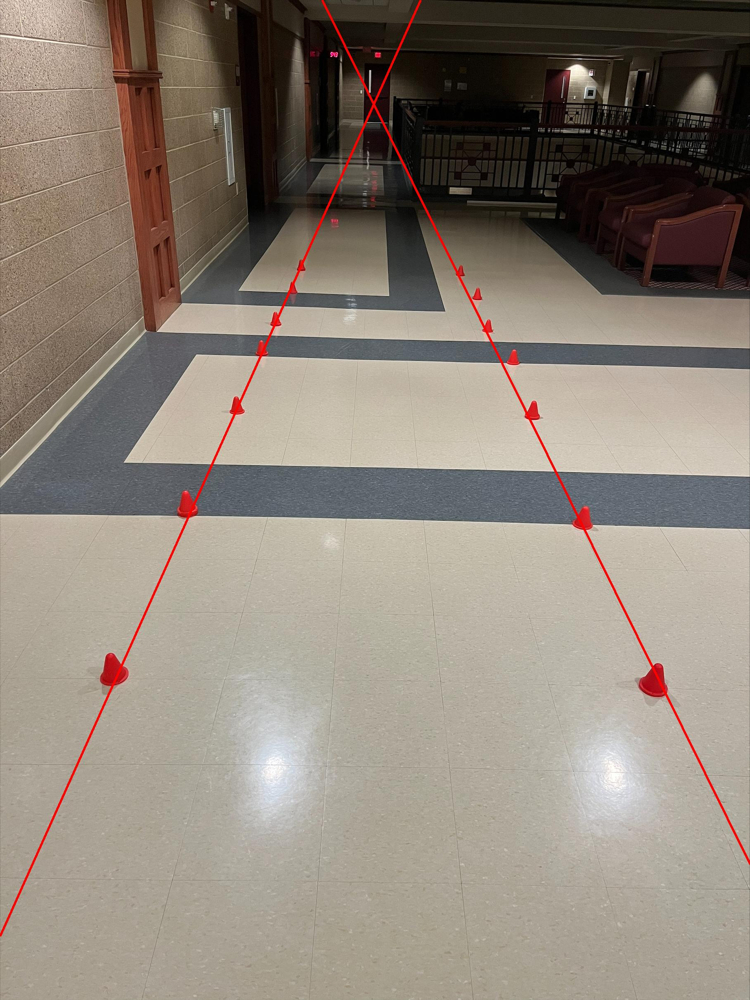

answer.png: 

Methodology: 
Step 1: loaded the image and initialized the drawing object to draw on the image 

Step 2: initilized upper and lower bound to identify the color pixels on the cones, line color and width, ranges of where to look for the pixels, and the pixel count and coordinates arrays 

Step 3: iterate through all the pixels in the image. if the pixel is within the color and x range, increment the pixel_count and store the coordinates. Does this for both x ranges. Prints out how many pixels in that range. 

Step 4: Gets the points for the drawn line to extend to via extend_line. This way it extends all the way to the end of the image. 

Step 5: if there are pixels found, it sorts them in ascending order, connects the lowest to the highest one (so that the line is an average of all the pixel points found) and draws the extended line

Step 6: shows the image with the extended lines. 

What I initallty tried was to get an average color range of the red, instead of an upper and lower bound. However that didnt work because the light is shined onto the cones at different intensity and angle and thus changes the exact rgb value of the cone. Then I moved onto the range and it was identifying the cone points, but whenver a line was drawn it would zigzag across the image, connecting the left side cone to the right. This is why a x-range bound was added so that it would only look for red pixels in a specified area. Once these pixels were found, it would get the first instance and last instance of the pixel and draw a line through it, as an average of the locations of the cones. This is line is then extended via extend_line and results in the final image. The hardest part of this was to aviod the line from zigzagging across the image and to extend the line in the same angle and direction as the original line. 

Libraries used: PIL, Image, ImageDraw, math